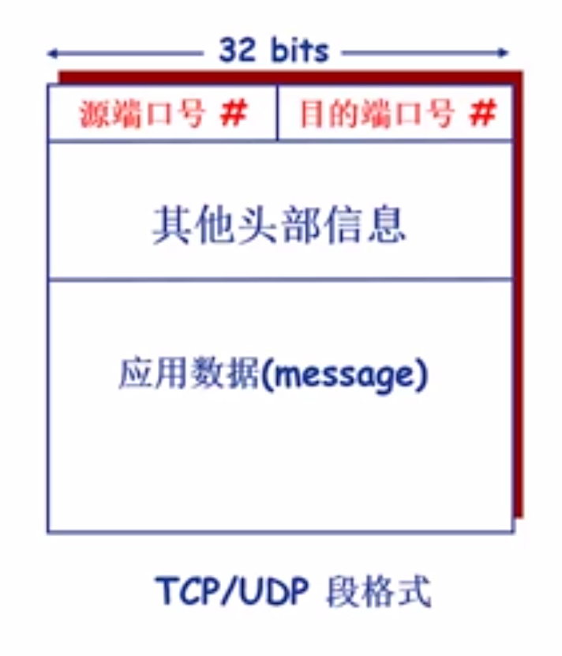
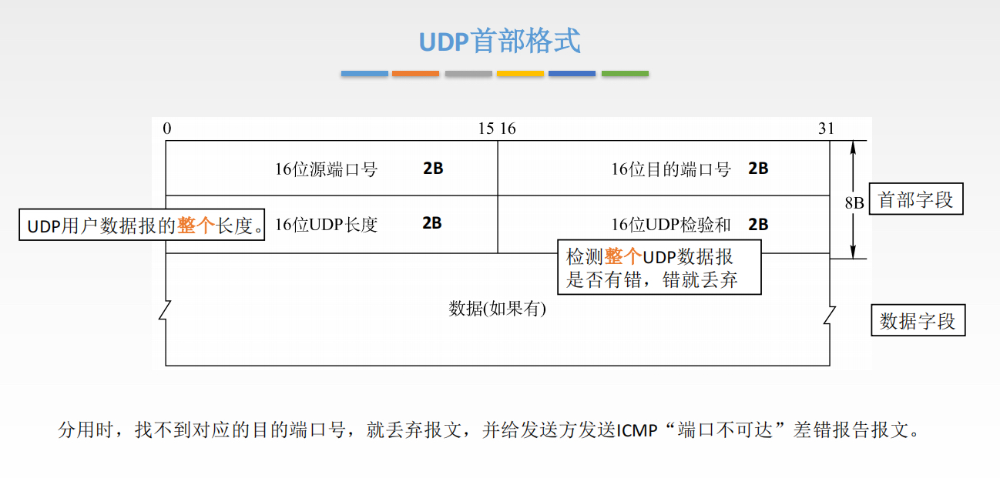
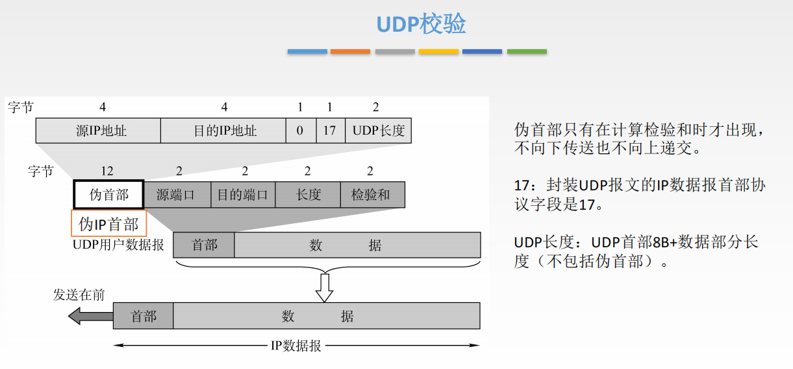
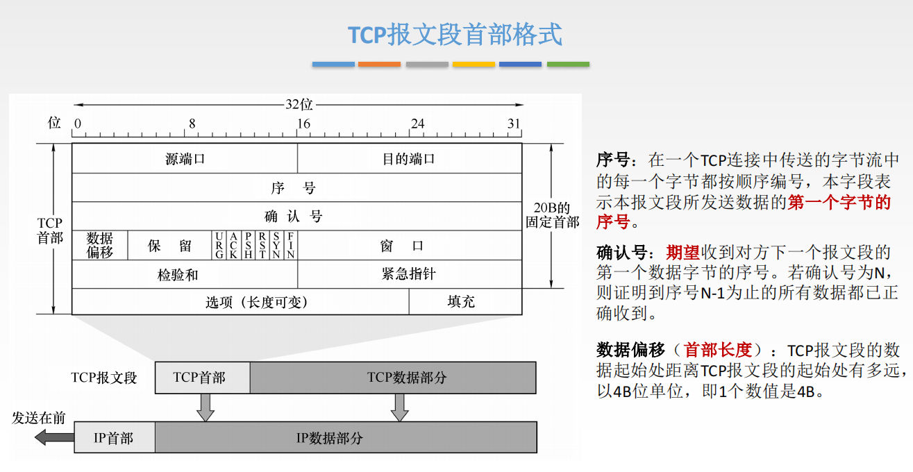
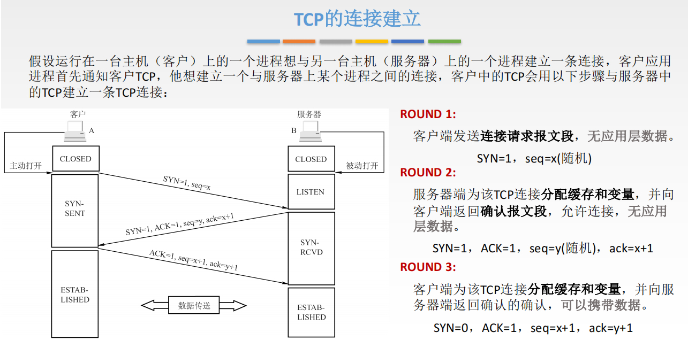
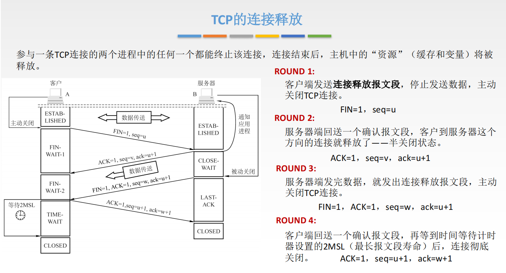
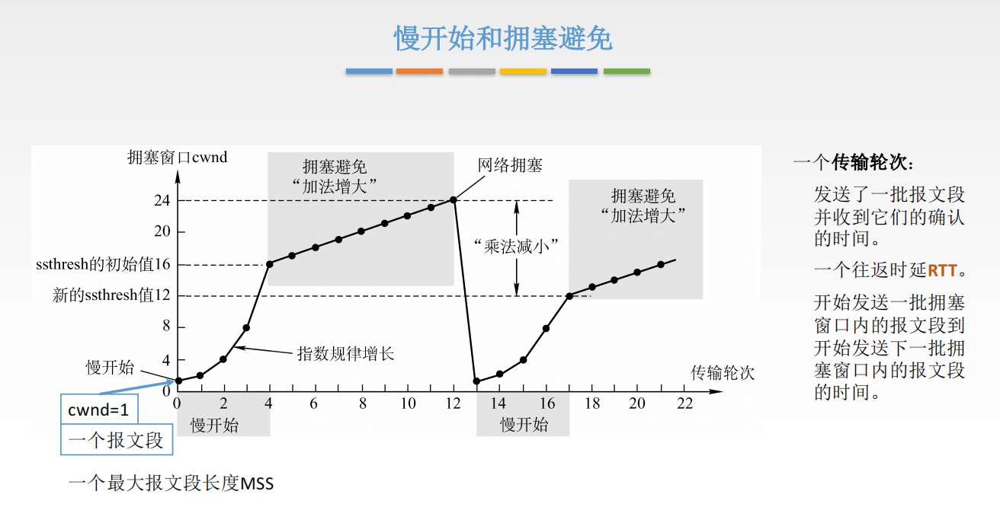
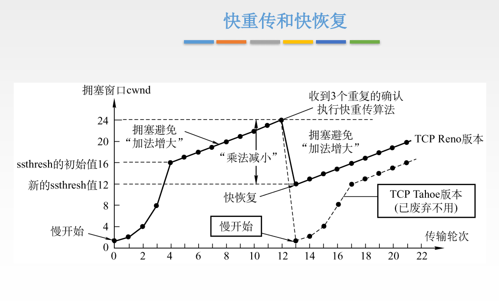

## 传输层

### 多路复用和多路分用：（多进程和多线程实现）

- 多路复用：从多个Socket接收数据，为每块数据封装上头部信息，生成Segment，交给网络层；
- 多路分用：传输层依据头部信息将收到的Segment交给正确的Socket，即不同的进程；

UDP的Socket用二元组标识：（目的IP地址，目的端口号）；

TCP的Socket用四元组标识：（源IP地址，源端口号，目的IP地址，目的端口号）；

### UDP（用户数据报协议）

- 基于IP协议，增加两个功能：

  1. 复用/分用；
  2. 简单的错误校验；

- "Best effort"服务（尽力而为服务），UDP可能：

  1. 丢失；
  2. 非按序到达；

- UDP是无连接服务：

  1. UDP发送方和接收方之间不需要建立连接；
  2. 每个UDP段段处理独立于其他段；

- UDP是面向报文的：
  1. 应用层给UDP多长的报文，UDP就照样发送，不会拆分，即一次发送一个完整的报文；
  2. 适合一次性传输少量数据的网络应用；

- UDP为什么存在（优点）：

  1. 无需建立连接（减少延迟）；
  2. 实现简单：无需维护连接状态；
  3. 头部开销少（UDP头部8个字节，TCP头部20个字节）；
  4. 没有拥塞控制：应用可更好地控制发送时间和速率（适合实时应用，如视频应用）；

- UDP校验和：

  

  发送方将伪首部 + 首部 + 数据段 视为16bit的整数倍（不够的在数据段填充上0），求所有16bit的字段的和，进位加在和的后面，将得到的值按位求反，得到校验和；接收发收到UDP报文后进行同样操作，比较校验和是否相等：

  - 不相等：检验出错误，丢弃或给上层传递出错信息；
  - 相等：没有检验出错误（但可能有错误）；

### 可靠数据传输

1. rdt1.0（停等协议）：假设信道完全可靠；
2. rdt2.0（停等协议）：假设信道上只会发送数据翻转，新增：
   - 差错检验（校验和）；
   - 接收方反馈控制消息：ACK/NAK；
   - 重传；
3. rdt2.1（停等协议）：ACK/NAK可能会被破坏，重传可能产生重复分组，新增：
   - 序列号（Sequence number）：发送方给每个分组增加序列号；
   - 接收方丢弃重复分组；
   - 序列号只用两个就够了（0，1）：因为是停等协议；
4. rdt2.2（停等协议）：无NAK消息协议，只使用ACK：
   - 接收方通过ACK告知最后一个被正确接收的分组；
   - 在ACK中显式地加入确认分组的序列号；
   - 发送方在收到重复的ACK分组后，采取与收到NAK消息相同的动作：重传当前分组；
5. rdt3.0（停等协议）：信道既可能发生错误，也可能丢失分组，新增：
   - 等待时间，超过等待时间没收到ACK就重传；

停等协议使得信道利用率很低：滑动窗口机制（有n个序列号）

- 后退N帧协议（GBN）：
  - 发送方窗口最大为n - 1，接收方窗口大小为1；
  - 累计确认机制，发送方收到ACK(i)，则i与i之前的分组都已被接收方收到；
- 选择重传协议（SR）：
  - 接收方窗口大小大于1，可以缓存接收到的分组；
  - 发送方窗口大小 + 接收方窗口大小 <= n；
  - 每个帧都有自己的定时器，超时只重传对应的帧，即每个帧都要收到对应的确认帧才算成功发送

### TCP（传输控制协议）：

- 点对点：一个发送方，一个接收方；
- 可靠的、按序的字节流，累计确认 + 选择确认；
- 一般一个连接只有一个定时器，且该定时器与最早的未被确认的报文段相关联，若在该定时器内收到了之后的报文段的确认报文，则认为最早未被确认的报文段已被确认；
- 通过拥塞控制机制和流量控制机制来动态设置窗口尺寸；
- 发送方和接收方都有缓存；
- 面向连接：
  - 通信双方在发送数据之前必须建立连接；
  - 连接状态只在连接的两端（端设备）中维护，不在沿途节点中维护；
  - TCP连接包括：两台主机上的缓存、连接状态变量、socket等
- 全双工：同一连接中能够传输双向数据流；

- `紧急位URG`：URG=1时，标明此报文段中有紧急数据，是高优先级的数据，应尽快传送，不用在缓存里排队，配合紧急指针字段使用；
- `确认位ACK`：ACK=1时，确认号有效，在连接建立后所有传送的报文段都必须把ACK置为1；
- `推送位PSH`：PSH=1时，接收方尽快交付接收应用进程，不再等到缓存填满再向上交付；
- `复位RST`：RST=1时，表明TCP连接中出现严重差错，必须释放连接，然后再重新建立传输连接；
- `同步位SYN`：SYN=1时，表明是一个连接请求/连接接受报文；
- `终止位FIN`：FIN=1时，表明此报文发送方数据已发完，要求释放连接；

- TCP校验和使用的伪首部的第四个字段为6（UDP为17）；

#### TCP三次握手：

#### TCP四次挥手：

为什么客户端要等待2MSL才关闭连接：

如果最后一次挥手服务器没有收到，则服务器会重传第三次挥手报文，若此时客户端已经关闭，则服务器就无法得到第四次挥手报文，会一直发送第三次挥手报文，服务器就无法正常关闭连接。

#### TCP流量控制机制（点对点）：

在通信过程中，接收方根据自己接收缓存的大小，动态地调整发送方的发送窗口大小，即**接收窗口rwnd**（接收方设置确认报文段段窗口字段来将rwnd通知给发送方），发送方的发送窗口取接收窗口rwnd和拥塞窗口cwnd的最小值。

TCP为每个连接设有一个**持续计时器**，只要TCP连接的一方收到对方的**零窗口通知**，就启动持续计时器。若持续计时器设置的时间到期，就发送一个**零窗口探测报文段**。接收方收到探测报文段时给出现在的窗口值。若窗口仍然为0，那么发送方就重置持续控制器。

#### TCP拥塞控制机制（全局）：

接收窗口：接收方根据接收缓存设置的值，并告知给发送方，反映接收方容量；

拥塞窗口：发送方根据自己估算的网络拥塞程度而设置的窗口值，反映网络当前容量；

