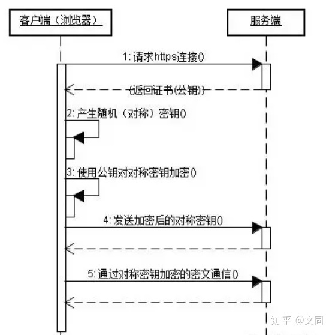

## 应用层

| 应用         | 应用层协议                  | 支撑的运输协议 |
| ------------ | --------------------------- | -------------- |
| 电子邮件     | SMTP                        | TCP            |
| 远程终端访问 | Telnet                      | TCP            |
| Web          | HTTP                        | TCP            |
| 文件传输     | FTP                         | TCP            |
| 流式多媒体   | HTTP                        | TCP            |
| 因特网电话   | SIP、RTP、专用的（如Skype） | UDP或TCP       |

### HTTP：超文本传输协议

- **无状态协议**：HTTP服务器不保存关于客户的任何信息；

- 使用了**客户—服务器**应用程序体系结构，Web服务器一直打开；

- 默认是**持续连接**：所有的请求/响应对是经过相同的TCP连接发送的，

  （**非持续连接**：每个请求/响应对是经过一个单独的TCP连接发送的）；

- 服务器端默认端口号：**80**；

#### HTTP报文格式：

1. HTTP请求报文：

   ```http
   Get /somedir/page.html HTTP/1.1
   Host: www.someschool.edu
   Connection: close
   User-agent: Mozilla/5.0
   Accept-language: fr
   ```

   HTTP请求报文的第一行叫做**请求行**，后继的行叫做**首部行**；

   请求行有3个字段：方法字段（GET、POST、HEAD、PUT、DELETE）、URL字段和HTTP版本字段（自解释）；

   - `GET`：向服务器请求对象，在URL字段中带有请求对象的标识，此时实体主体为空；
   - `POST`：用户仍向服务器请求一个对象（如Web页面），但Web页面的特定内容依赖于用户在表单字段中的输入值（注：用表单生成的请求报文不是必须使用POST方法）。当为POST请求时，实体主体(entity body)中包含的就是用户在表单字段中的输入值；
   - `HEAD`：类似于GET方法，当服务器收到使用HEAD方法的请求时，将会用一个HTTP报文进行响应，但不返回请求对象（常用于应用程序的调试跟踪）；
   - `PUT`：允许用户上传对象到指定的Web服务器上指定的路径；
   - `DELETE`：允许用户删除Web服务器上的对象；

   `Connection: close`：要求服务器使用非持续连接，即服务器在发送完被请求的对象后就关闭这条连接；

   `User-agent: Mozilla/5.0`：指明用户代理，即享服务器发送请求的浏览器类型；

   `Accept-language: fr`：要求服务器发送的对象的语言版本，该条首部行仅仅是HTTP中可用的众多内容协商首部之一；

   

2. HTTP响应报文：

   ```http
   HTTP/1.1 200 OK
   Connection: close
   Date: Tue, 09 Aug 2011 15:44:04 GMT
   Server: Apache/2.2.3 (CentOS)
   Last-Modified: Tue, 09 Aug 2011 15:11:03 GMT
   Connect-Length: 6821
   Connect-Type: text/html
   
   (data data data data ...)
   ```

   上面的HTTP响应报文有3个部分：1个初始**状态行**，6个**首部行**，然后是**实体体**；

   实体体部分是报文的主要部分，即它包含了所请求的对象本身（表示为data data data ...）；

   状态行有3个字段：协议版本字段、状态码和相应状态信息；

   - `200 OK`：请求成功，信息在返回的响应报文中；
   - `301 Moved Permanently`：请求对象已经被永久转移了，新的URL定义在响应报文的`Location:`首部行中；
   - `400 Bad Request`：一个通用差错代码，指示该请求不能被服务器理解；
   - `404 Not Found`：被请求的文档不在服务器上；
   - `505 HTTP Version Not Supported`：服务器不支持请求报文所使用的HTTP协议版本；

   `Connection: close`：告诉客户，发送完报文后将关闭该TCP连接；

   `Date`：首部行指示服务器产生并发送该响应报文的日期和时间。这个时间不是指对象创建或最后修改的时间，而是服务器从它的文件系统中检索到该对象，插入到响应报文，并发送该响应报文的时间；

   `Server`：指示服务器类型；

   `Last-Modified`：指示了对象创建或者最后修改的日期和时间。该行对代理服务器来说很重要；

   

#### cookie：

HTTP服务器是无状态的，但Web站点通常希望去识别用户，为此，HTTP使用了cookie，来允许站点对用户进行跟踪；

cookie技术有4个组件：

1. 在HTTP响应报文中的一个cookie首部行；
2. 在HTTP请求报文中的一个cookie首部行；
3. 在用户端系统中保留有一个cookie文件，并由用户的浏览器进行管理；
4. 位于Web站点的一个后端数据库；


#### Web缓存：

**Web缓存器**(Web cache)也叫**代理服务器**(proxy server)，它是能够代表初始Web服务器来满足HTTP请求的网络实体。Web缓存器有自己的磁盘存储空间，并在存储空间中保存最近请求过的对象的副本。


Web缓存器通常由ISP购买并安装，好处：

1. Web缓存器可以大大减少对客户请求的响应时间，特别是当客户与初始服务器之间的瓶颈带宽远低于客户与Web缓存器之间的瓶颈带宽时更是如此；
2. Web缓存器能够大大减少一个机构的接入链路到因特网的通信量。通过减少通信量，该机构就不必急于增加带宽，因此降低了费用；
3. Web缓存器能从整体上大大减低因特网上的Web流量，从而改善了所有应用的性能；

#### 条件GET方法：

如果：1.请求报文使用GET方法；并且2.请求报文中包含一个`If-Modified-Since:`首部行。那么，这个HTTP请求报文就是一个条件GET请求报文。用于判Web缓存器上的对象副本是否为最新的。

例：

1. Web缓存器代表一个请求浏览器向某Web服务器发送一个请求报文：

   ```http
   GET /fruit/kiwi.gif HTTP/1.1
   Host: www.exotiquecuisine.com
   ```

   

2. 该Web服务器向缓存器发送具有被请求对象的响应报文：

   ```http
   HTTP/1.1 200 OK
   Data: Sat, 8 Oct 2011 12:39:29
   Server: Apache/1.3.0 (Unix)
   Last-Modified: Web, 7 Sep 2011 09:23:24
   Content-Type: image/gif
   
   (data data data ...)
   ```

   

3. 该缓存器在将对象转发到请求浏览器的同时，也在本地缓存了该对象，重要的是，缓存器在存储该对象时也存储了最后的修改日期，即响应报文中的`Last-Modified:`首部行的值。一个星期后，用户再经过该缓存器请求同一个对象，该对象仍在缓存器中。由于在过去的一个星期中位于Web服务器上的对象可能已经被修改了，该缓存器通过发送一个条件GET执行最新检查，其中`If-Modified-Since:`首部行的值正好等于一个星期前服务器发送的响应报文中的`Last-Modified:`首部行的值：

   ```http
   Get /fruit/kiwi.gif HTTP/1.1
   Host: www.exotiquecuisine.com
   If-Modified-Since: Web, 7 Sep 2011 09:23:24
   ```

   

4. 该条件GET报文告诉Web服务器，仅当自指定日期之后该对象被修改过，才发送该对象。假设未被修改，Web服务器向该缓存器发送一个响应报文：

   ```http
   HTTP/1.1 304 Not Modified
   Data: Sat, 15 Oct 2011 15:39:29
   Server: Apache/1.3.0 (Unix)
   
   (empty entity body)
   ```

5. 作为条件GET方法的响应，该Web服务器仍会发送一个响应报文，但是不会包含所请求的对象，即实体主体为空。而状态行中的`304 Not Modified`，它告诉缓存器可以使用该对象，能向请求的浏览器转发它缓存的该对象副本。

### HTTPS：（HyperText Transfer Protocol over Secure Socket Layer）

一般理解为HTTP+SSL/TLS，通过 SSL证书来验证服务器的身份，并为浏览器和服务器之间的通信进行加密。服务器端默认端口：**443**；

由于HTTP协议是明文传输，存在被盗取和篡改数据的风险，所以使用HTTPS来进行加密传输。

#### SSL/TLS：

SSL（Secure Socket Layer，安全套接字层）：1994年为 Netscape 所研发，SSL 协议位于 TCP/IP 协议与各种应用层协议之间，为数据通讯提供安全支持。

TLS（Transport Layer Security，传输层安全）：其前身是 SSL，它最初的几个版本（SSL 1.0、SSL 2.0、SSL 3.0）由网景公司开发，1999年从 3.1 开始被 IETF 标准化并改名，发展至今已经有 TLS 1.0、TLS 1.1、TLS 1.2 三个版本。SSL3.0和TLS1.0由于存在安全漏洞，已经很少被使用到。TLS 1.3 改动会比较大，目前还在草案阶段，目前使用最广泛的是TLS 1.1、TLS 1.2。

#### 浏览器在使用HTTPS传输数据的流程：[彻底搞懂HTTPS的加密原理](https://zhuanlan.zhihu.com/p/43789231)



1. 首先客户端通过URL访问服务器请求建立https连接；
2. 服务端收到客户端请求后，会将网站支持的证书信息（证书中包含公钥）传送一份给客户端；
3. 客户端的服务器开始协商SSL连接的安全等级，也就是信息加密的等级；
4. 客户端的浏览器根据双方同意的安全等级，建立会话密钥，然后利用网站的公钥将会话密钥加密，并传送给网站；
5. 服务器利用自己的私钥解密出会话密钥；
6. 服务器利用会话密钥加密与客户端之间的通信；

#### HTTPS的缺点：

- HTTPS协议多次握手，导致页面的加载时间延长近50%；
- HTTPS连接缓存不如HTTP高效，会增加数据开销和功耗；
- 申请SSL证书需要钱，功能越强大的证书费用越高；
- SSL涉及到的安全算法会消耗 CPU 资源，对服务器资源消耗较大；

### FTP（文件传输协议）：

FTP使用了两个并行的TCP连接来传输文件：

- **控制连接**：用于两个主机之间传输控制信息，如用户标识、口令、改变远程目录的命令以及“存放(put)”和“获取(get)”文件的命令；
- **数据连接**：用于实际发送一个文件；

每一次文件传输都要建立一个新的数据连接（TCP握手），而在整个会话期间，控制连接不断开，且FTP服务器一直保留用户的状态，跟踪用户在远程目录树上的当前位置，所以FTP协议是有状态的协议（HTTP协议不保存客户信息，是无状态的协议）。

### DNS（Domain Name System 域名系统）：

DNS是：1.一个由分层的DNS服务器实现的分布式数据库；2.一个使得主机能够查询分布式数据库的应用层协议。

DNS协议运行在UDP之上，使用53号端口。

DNS通常是由其他应用层协议所使用的，包括HTTP、FTP、SMTP，将用户提供的主机名解析为IP地址。

DNS的其他服务：1.主机别名、2.邮件服务器别名、3.负载均衡。

DNS服务器结构（自顶向下）：根DNS服务器 ---> 顶级DNS服务器 ---> 权威DNS服务器 ---> 本地DNS服务器


通常，从请求主机到本地DNS服务器的查询是递归的，其余查询是迭代的。

**DNS缓存**：为了改善时延性能并减少在因特网上到处传输的DNS报文数量，每个DNS服务器都会将接收到的DNS回答缓存在本地，但域名和IP地址的映射不是永久的，所以需要一段时间后丢弃缓存的信息。

**DNS记录**：4元组（Name, Value, Type, TTL）

| Name   | Value                                         | Type  | 备注                                       |
| ------ | --------------------------------------------- | ----- | ------------------------------------------ |
| 主机名 | 该主机名对应的IP地址                          | A     | 如：(relay1.bar.foo.com, 145.37.93.126, A) |
| 域     | 知道该域中的主机IP地址的权威DNS服务器的主机名 | NS    | 如：(foo.com, dns.foo.com, NS)             |
| 别名   | 别名为Name的主机对应的规范主机名              | CNAME | 如：(foo.com, relay1.bar.foo.com, CNAME)   |
| 别名   | 别名为Name的邮件服务器的规范主机名            | MX    | 如：(foo.com, mail.bar.foo.com, MX)        |

使用CNAME和MX可以使同一个组织的Web服务器和邮件服务器使用相同的别名。
