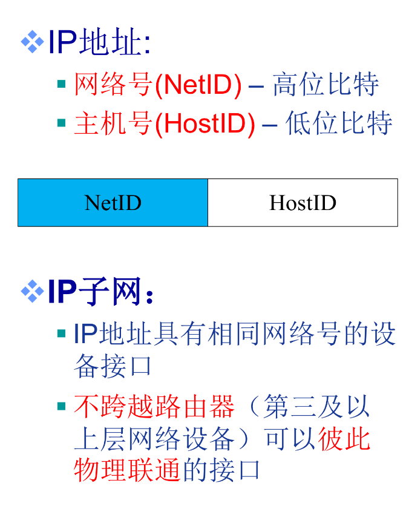

## 网络层

- 版本号：IPv4，IPv6；
- 首部长度：以**4字节**为单位，最小是5（IP首部最小长度即为固定部分的长度20Byte）；
- 服务类型（区分服务）：一般情况下不使用；
- 总长度：以**1字节**为单位，最小是20B，最大是65535B，所以IP分组可以封装的最大数据为65535 - 20 = 65515B；
- 标识：标识一个IP分组，同一分组的IP数据报的标识相同；
- 标志位：3位，第一位保留，第二位为DF(Don't Fragment)，第三位为MF(More Fragment)；
  - `DF = 1`：禁止分片；
  - `DF = 0`：允许分片；
  - `MF = 1`：非最后一片；
  - `MF = 0`：最后一片或未分片；
- 片偏移：以**8字节**为单位，一个IP分组分片封装原IP分组数据的相对偏移量（该IP分片的总长度 - 首部长度）；
- 生存时间：IP分组在网络中可以通过的路由器数（或跳步数）；
  - 路由器转发一次，TTL减1；
  - 若TTL = 0，则路由器丢弃该分组；
- 协议：指示IP分组封装的是哪个协议的数据报（TCP为6，UDP为17）；
- 首部校验和：实现对IP分组**首部**的差错检验（数据部分由传输层协议进行差错检验）

### IP分片：

网络链路中存在MTU（最大传输单元）——链路层数据帧可封装数据的上限（即IP数据报的最大长度）；若IP数据报的总长度大于MTU，就要进行分片，IP分片到达目的主机后进行“重组”。

### IP子网：

子网掩码：网络号全为1，主机号全为0；与某主机的IP地址按位相与可得到该主机所在子网的IP（网络地址）。

### CIDR（无类域间路由）

融合子网地址和子网掩码；

格式：a.b.c.d/x，其中x为前缀长度；

前缀相同的IP地址属于同一子网，多个前缀相同的子网构成超网；

在路由转发时采用**最长前缀匹配优先**原则，选择更具体的路由（前缀越长，子网的范围就越小）。

### DHCP（动态主机配置协议）

DHCP属于**应用层**协议，使用**客户/服务器**方式，客户和服务器通过**广播方式**进行交互，基于**UDP**；

DHCP提供**即插即用**联网的机制，主机可以从服务器动态获取IP地址、子网掩码、默认网关、DNS服务器名称与IP地址，允许地址重用，支持移动用户加入网络，支持在线续租；

交互流程（全是以广播形式交互）：

1. 主机广播DHCP**发现**报文；
2. DHCP服务器广播DHCP**提供**报文；
3. 主机广播DHCP**请求**报文；
4. DHCP服务器广播DHCP**确认**报文

### NAT（网络地址转换协议）

在**局域网**连接到**因特网**的路由器上安装NAT软件，安装了NAT软件的路由器叫做**NAT路由器**，通过其内部的**NAT转换表**来进行局域网IP和因特网IP的转换。

### ICMP（互联网控制报文协议）

类型(Type) + 编码(Code)的组合构成ICMP报文的含义；

根据功能可分为两类报文：

1. 差错报告报文（5种）：在IP数据报出现错误时向源IP地址发送的报文（封装在IP数据报中，作为IP数据报的数据部分）
   1. 目的不可达：目的IP或端口错误；
   2. 源抑制：路由器或目的主机因拥塞而丢弃数据；
   3. 超时/超期：TTL=0；
   4. 参数问题：某IP数据报首部字段有问题；
   5. 重定向：某IP数据报应由其他路由转发；
2. 问询报文（2种）：由主机或路由器主动发出的用于网络探询的报文
   1. 回声(Echo)请求和应答(Reply)报文：如Ping（测试两个主机之间的连通性）；
   2. 时间戳请求和应答报文；

不发送ICMP差错报文的特殊情况：

1. 对**ICMP差错报告报文**不再发送ICMP差错报告报文；
2. IP数据报分片后，除了第一个IP分片外，对所有**后续分片**均不发送ICMP差错报告报文；
3. 对所有**组播**的IP数据报都不发送ICMP差错报告报文；
4. 对具有**特殊地址**（如127.0.0.0或0.0.0.0）的IP数据报不发送ICMP差错报告报文；

IP数据报的数据部分的前8个字节包含了UDP/TCP封装的源端口号和目的端口号。

### IPv6

相较于IPv4的改变：

1. IPv6将IP地址从32位（4字节）扩展到了128位（16字节）；
2. 将IPv4的首部可选字段移除首部，变成了扩展首部，提高路由器的处理效率；
3. 移除校验和字段，减少每一跳处理的时间；
4. ICMP报文新增类型："Packet Too Big"；
5. IPv6提供即插即用（即自动配置），不再需要DHCP；
6. IPv6只能在主机处分片，IPv4可以在主机和路由器处分片；
7. IPv6取消了服务类型字段；

IPv4向IPv6的过渡策略：

1. 双栈协议：在一台设备上同时启动IPv4协议栈和IPv6协议栈；
2. 隧道技术：将IPv6数据报封装成IPv4数据报的数据部分；